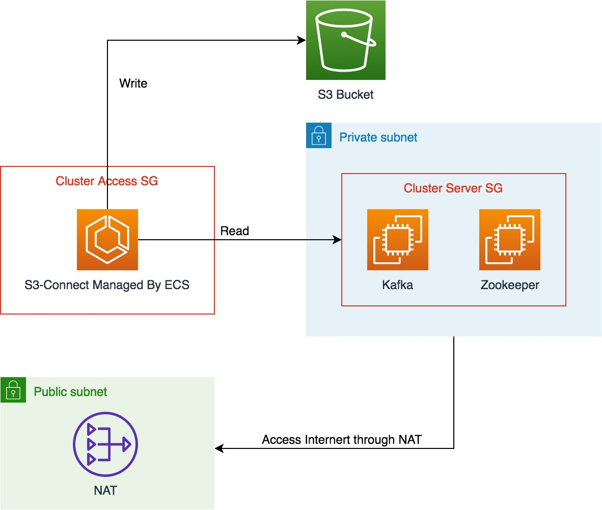

# 简介

自动化部署 **Zookeeper** 和 **Kafka**，



Zookeeper: 3.4.6
Kafka: 0.10.1

请注意本实验中的 Kafka-S3-Connect 配置仅支持 JSON 格式；可根据需要求改 
`s3-connect/quickstart-s3.properties` 和 `s3-connect/connect-standalone.properties` 文件

## 部署前提

1. 本机已经安装 [Terraform](https://www.terraform.io/downloads.html)

2. 请确保您可以访问堡垒机 

3. 请确保已经创建 subnet 用户创建集群，并且集群可以主动访问 Internet, 强烈建议使用 private subnet, 通过 NAT 访问 Internet

4. 安装过程中，需要从 Internet 下载资源包，软件安装完毕后，可以断开 Internet 访问


## 安装步骤

1. 根据 `variables.tf` 文件 ``修改 ，如果选择是 private subnet, 请确保已经绑定 **NAT** 网关

2. 执行 **Terraform** 脚本
```bash
terraform init
terraform apply
```
> 执行完脚本，需要等待EC2 安装 JAVA, Zookeeper等软件，需要等待几分钟。请确定Java等软件已经
> 安装完成再执行以下操作

3. 登录一台 **Zookeeper** 实例，将生成的配置文件拷贝到 zookeeper 目录下

```shell
sudo cp /tmp/zoo.cfg /opt/zookeeper/conf/
```

或者修改 `/opt/zookeeper/conf/zoo.cfg`. 将文件
中的IP地址改成 Zookeeper 的 **Private IP**, 如:

```text
server.1=172.31.100.52:2888:3888
server.2=172.31.101.242:2888:3888
server.3=172.31.102.42:2888:3888
```

4. 启动 Zookeeper, 请设置为随机启动。

```shell
sudo systemctl start zoo
sudo systemctl enable zoo
```

5. 登录其他 **Zookeeper** 实例, 重复步骤 3, 4。 

6. 登录一台 **Kafka** 实例，启动 Kafka 进程, 并设置成随机启动

```shell
sudo systemctl start kafka
sudo systemctl enable kafka
```

7. 登录其他 **Kafka** 实例， 重复步骤6。


## 创建 Kafka-S3-Connect 镜像

修改 `s3-connect/connect-standalone.properties` 文件

* **bootstrap.servers**: Kafka 集群地址。请查看 Terraform 输出


修改 `s3-connect/quickstart-s3.properties` 文件

* **topics**: topic list, 如: `s3connect,test`, 以逗号分割
* **s3.region**: S3 region
* **s3.bucket.name**: S3 桶名称
* **flush.size**: 单个输出文件包含message数量

通过 `docker` 创建 docker image.

本教程中，Terraform 会自动创建具有访问 S3 权限的IAM Role, 以 **S3-Connect-** 开头。
需要为部署 S3-Connect 的实例配置 IAM Role.

给实例绑定 以 **Kafka-Access-** 开头的安全组，即可访问 kafka 和 Zookeeper 集群。

## 测试命令

测试使用的 topic 为 `s3connect`

```shell
# 创建topic
./kafka-topics.sh --zookeeper 172.31.100.52:2181,172.31.101.8:2181,172.31.102.42:2181 --create --topic s3connect --partitions 3 --replication-factor 2

# describe topic
./kafka-topics.sh --zookeeper 172.31.100.52:2181,172.31.101.8:2181,172.31.102.42:2181 --describe --topic s3connect

# 给 kafka 发送消息
./kafka-console-producer.sh --broker-list 172.31.100.83:9092,172.31.101.104:9092,172.31.102.50:9092 --topic s3connect

# 获取 Kafka 消息
./kafka-console-consumer.sh --bootstrap-server 172.31.100.83:9092,172.31.101.104:9092,172.31.102.50:9092  --topic s3connect --from-beginning
```

**测试用 message**
{"value": "New", "onclick": "CreateNewDoc"}
{alignment": "center"}


```shell
./kafka-avro-console-producer \
--broker-list 172.31.100.222:9092,172.31.101.32:9092,172.31.102.198:9092 --topic s3connect4 \
--property value.schema="$(jq -r tostring /tmp/s3-connect/schema.avsc)"
```

```shell
./bin/kafka-avro-console-producer \
--broker-list 127.0.0.1:9092 --topic s3connect4 \
--property value.schema="$(jq -r tostring /tmp/s3-connect/schema.avsc)"
```


## Start Docker container

```shell
docker run -d \
  --name=kafka-connect \
  --net=host \
  -e CONNECT_BOOTSTRAP_SERVERS=localhost:29092 \
  -e CONNECT_REST_PORT=28082 \
  -e CONNECT_GROUP_ID="quickstart" \
  -e CONNECT_CONFIG_STORAGE_TOPIC="quickstart-config" \
  -e CONNECT_OFFSET_STORAGE_TOPIC="quickstart-offsets" \
  -e CONNECT_STATUS_STORAGE_TOPIC="quickstart-status" \
  -e CONNECT_KEY_CONVERTER="org.apache.kafka.connect.json.JsonConverter" \
  -e CONNECT_VALUE_CONVERTER="org.apache.kafka.connect.json.JsonConverter" \
  -e CONNECT_INTERNAL_KEY_CONVERTER="org.apache.kafka.connect.json.JsonConverter" \
  -e CONNECT_INTERNAL_VALUE_CONVERTER="org.apache.kafka.connect.json.JsonConverter" \
  -e CONNECT_REST_ADVERTISED_HOST_NAME="localhost" \
  -e CONNECT_PLUGIN_PATH=/usr/share/java \
  confluentinc/cp-kafka-connect:5.2.1
```


## Appendix

[Encode Error](https://stackoverflow.com/questions/50372884/kafka-s3-connect-value-is-not-struct-type-error)
[Pushing AVRO to Kafka](https://stackoverflow.com/questions/51664191/pushing-avro-file-to-kafka)
